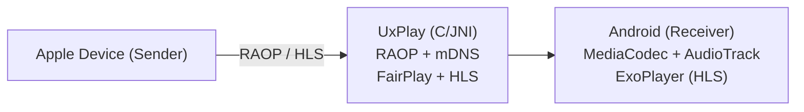

# AirPlay Receiver for Android

[](https://github.com/jqssun/android-airplay-server)
[](https://github.com/jqssun/android-airplay-server/releases)
[](https://github.com/jqssun/android-airplay-server/blob/main/LICENSE)
[](https://github.com/jqssun/android-airplay-server/actions/workflows/apk.yml)
[](https://github.com/jqssun/android-airplay-server/releases)

A fully featured free and open-source implementation of AirPlay for Android that turns your device into an AirPlay-compatible display and speaker, based on [UxPlay](https://github.com/FDH2/UxPlay). It is the first open-source AirPlay 2 receiver for Android and Android TV, and works with iOS/iPadOS, macOS devices as well as other sender implementations.

[](https://play.google.com/store/apps/details?id=io.github.jqssun.airplay)
[](https://f-droid.org/packages/io.github.jqssun.airplay)
[](https://github.com/jqssun/android-airplay-server/releases/latest)

<video loop src='https://github.com/user-attachments/assets/79ed7c0c-0102-43cc-8816-4f00ce6a4199' alt="demo" width="200" style="display: block; margin: auto;"></video>

## Türkçe Kurulum (Android Auto ile araç ekranında iPhone yansıtma)

Bu fork, iPhone ekranını AirPlay ile Android telefona yansıtıp görüntüyü Android Auto üzerinden araç ekranında göstermek için hazırlanmıştır. Uygulama Play Store'da yoktur; kişisel kullanım içindir.

> [!WARNING]
> Görüntü yalnızca araç park hâlindeyken izlenmelidir. Uygulama her Android Auto bağlantısında park onayı ister; sürüş sırasında ekranı izlemeyin, sorumluluk sürücüdedir.

### 1. APK'yı yükleyin

1. GitHub'da **Actions** sekmesinden son başarılı derlemeyi açın ve **Artifacts** bölümündeki APK'yı indirin.
2. Telefonda APK'yı açın. İstenirse dosyayı açtığınız uygulamaya (tarayıcı, dosya yöneticisi) **Bilinmeyen uygulamaları yükle** izni verin.
3. Uygulamayı telefonda bir kez açın ve istenen izinleri verin.

### 2. Android Auto geliştirici ayarlarını açın

Play Store dışından yüklenen uygulamalar Android Auto'da varsayılan olarak görünmez. Bunu açmak için:

1. Telefonda **Ayarlar → Bağlı cihazlar → Bağlantı tercihleri → Android Auto** bölümüne girin (bazı telefonlarda doğrudan Android Auto uygulamasını açın).
2. En alttaki **Sürüm** satırına art arda yaklaşık 10 kez dokunun ve geliştirici modunu onaylayın.
3. Sağ üstteki üç nokta menüsünden **Geliştirici ayarları**'nı açın.
4. **Bilinmeyen kaynaklar** (Unknown sources) seçeneğini etkinleştirin.
5. Android Auto ayarlarında **Başlatıcıyı özelleştir** bölümünden uygulamanın işaretli olduğunu kontrol edin.

### 3. Telefonun hotspot'unu açıp iPhone'u bağlayın

AirPlay için iPhone ile Android telefonun aynı ağda olması gerekir. Araçta en kolay yol Android telefonun hotspot'unu kullanmaktır:

1. Android telefonda **Ayarlar → Ağ ve internet → Hotspot ve tethering → Wi-Fi hotspot**'u açın.
2. iPhone'da **Ayarlar → Wi-Fi** bölümünden Android telefonun hotspot ağına bağlanın.

### 4. Araçta yansıtmayı başlatın

1. Telefonu araca bağlayın ve Android Auto ekranından uygulamayı açın.
2. Araç ekranında çıkan "Araç park hâlinde mi?" sorusunu **Evet, park hâlindeyim** ile onaylayın. AirPlay sunucusu başlamazsa uygulamayı telefonda bir kez açın.
3. iPhone'da **Denetim Merkezi → Ekran Yansıtma** bölümünden bu telefonu seçin.
4. Görüntü araç ekranında en-boy oranı korunarak gösterilir. Yansıtmayı bitirmek için araç ekranındaki **Durdur** düğmesine basın; bir sonraki açılışta park onayı tekrar istenir.

### Kablolu Android Auto önerilir

Kablosuz Android Auto, telefonun Wi-Fi bağlantısını araçla haberleşmek için kullanır. Birçok telefonda bu durum hotspot ile aynı anda çalışmaz ya da bağlantı kopmalarına ve gecikmeye yol açar. En kararlı sonuç için telefonu araca **USB kablosuyla** bağlayın; böylece telefonun Wi-Fi'ı yalnızca iPhone'un bağlandığı hotspot için kullanılır.

## Compatibility

- Android 7.0+, including Android TV
- AirPlay devices on the same subnet, including iOS/iPadOS, macOS devices, or other sender implementations

## Features

- Screen mirroring with H.264 and H.265 (HEVC) video decoding
- Audio streaming with AAC-ELD, AAC-LC and ALAC audio decoding
- Video playback with support for HLS, downloads, and remote controls
- Music playback with track information, cover art, and remote controls
- Support for Android TV with directional pad navigation and seeking controls
- Support for Picture-in-Picture, automatic resolution and mode switching
- Optional PIN authentication
- Video resolution, overscan, and frame rate control
- Audio latency control and support for software decoder fallback
- Debug overlay with real-time statistics (FPS, bitrate, codec, resolution, frame count, audio volume, etc.)
- Android native media session integration with notification controls

> [!WARNING]
> DRM content (e.g. from the Apple TV application) is not supported.

## Implementation

This application uses the C-based [UxPlay](https://github.com/FDH2/UxPlay) library to implement the AirPlay/RAOP protocol, with a JNI bridge to the Android application layer. Audio can be decoded via MediaCodec or a software ALAC decoder, while mirroring video is decoded via MediaCodec and rendered to a SurfaceView. HLS sessions are served through a local playlist proxy.



CMake is used for native C/C++ components under [`app/src/main/cpp`](app/src/main/cpp). Submodules must be initialized before building. 

```bash
git submodule update --init --recursive
./gradlew assembleDebug
```

Check out the [CI](https://github.com/jqssun/android-airplay-server/blob/main/.github/workflows/apk.yml) for more details on reproducible builds.

## Credits

- [UxPlay](https://github.com/FDH2/UxPlay) for the AirPlay/RAOP server implementation
- [FFmpeg](https://ffmpeg.org) for the lossless audio decoder
- [Next Player](https://github.com/anilbeesetti/nextplayer) for the video player

---

Disclaimer: This project is not affiliated with Apple Inc.
